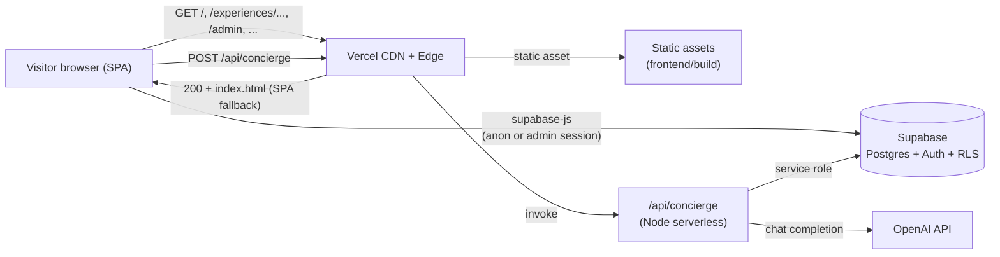
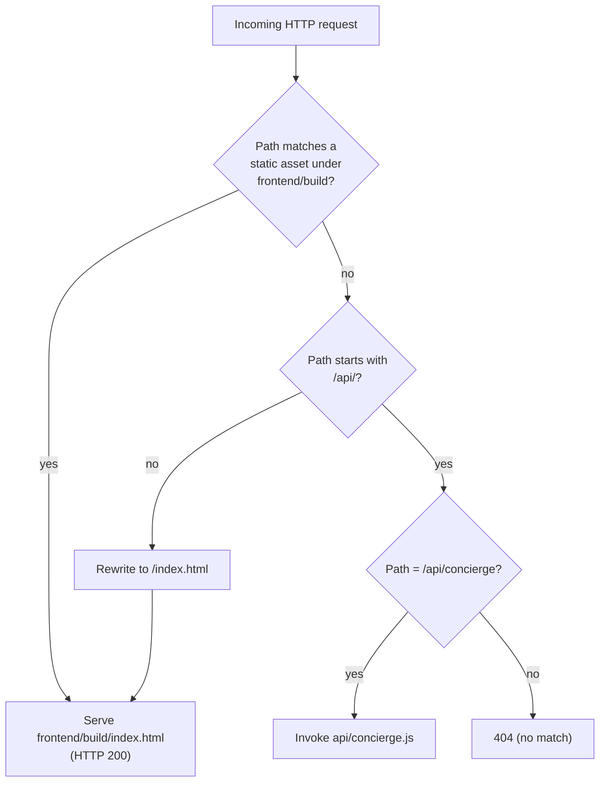
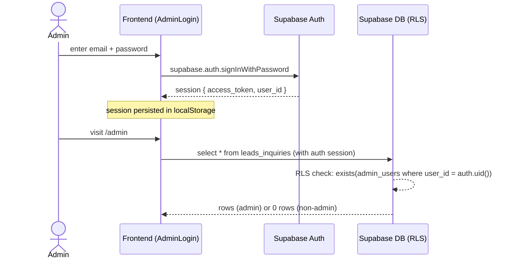
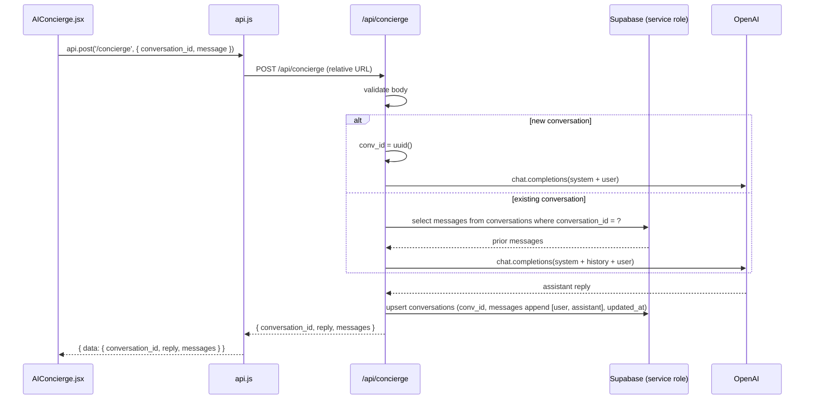

# Design Document

## Overview

This design replaces the FastAPI + MongoDB stack with a Vercel-native shape:

- The Create-React-App SPA in `frontend/` builds and serves from `frontend/build` via a `vercel.json` at the repo root.
- Non-`/api` paths fall back to `index.html` so React Router (BrowserRouter) routes work after a hard refresh.
- All public CRUD (`experiences`, `travel_stories`, `leads_inquiries`, admin reads/updates) moves into `frontend/src/lib/api.js`, which now translates each `api.<method>(path, body)` call into a `@supabase/supabase-js` query. RLS policies in Supabase replace the legacy `verify_admin_token` middleware.
- The AI concierge moves to a single Vercel Node.js serverless function at `api/concierge.js`. It calls OpenAI server-side and persists conversation history into a new Supabase table `conversations`. The OpenAI key never leaves the server.
- A single idempotent SQL migration (`supabase/migrations/0001_vercel_migration.sql`) creates/updates the schema, RLS policies, and seed data. The legacy `/api/setup/*` runtime endpoints disappear from the deploy path.
- The Python `backend/` directory is excluded from the Vercel build but remains in git history for roll-forward.

The `api` facade keeps the same surface (`api.get`, `api.post`, `api.patch`) and the same axios-shaped response envelope (`{ data }`) so no component or page file changes.

## Architecture

### High-Level Topology



### Request Routing On Vercel



The negative-lookahead rewrite pattern `^/((?!api/).*)$ → /index.html` ensures `/api/*` is never rewritten to the SPA, while every SPA route (e.g. `/experiences/wake-above-the-clouds`, `/admin`) survives a hard refresh.

### Authentication Flow For Admin



### Concierge Flow



### Design Decisions And Rationales

| Decision | Rationale |
| --- | --- |
| `vercel.json` at repo root, build from `frontend/` | Vercel needs a project-root config; the SPA build lives in a subdirectory so `outputDirectory` must point to `frontend/build`. |
| Negative-lookahead rewrite `/((?!api/).*)` | Keeps `/api/*` routable to serverless functions while letting BrowserRouter routes survive hard refresh. |
| Single Node function `api/concierge.js` | Only one route requires server-side secrets (OpenAI key); a single function minimizes cold starts and config surface. |
| Move concierge history from MongoDB to Supabase `conversations` | Removes Mongo dependency entirely; centralizes data on one provider; Postgres + JSONB adequately models append-only message arrays. |
| Use Supabase **service role** key inside the function | Bypasses RLS so the function can read/write `conversations` even though the table denies anon. The key never reaches the browser. |
| RLS replaces `verify_admin_token` middleware | Authorization moves into the database. Frontend calls run with the user's signed-in JWT; Supabase enforces `admin_users.user_id = auth.uid()` server-side. |
| Keep `api.js` as a thin facade with the same surface | Component code stays untouched. The migration is invisible to callers except for the data path change. |
| One-shot SQL migration, not a runtime endpoint | Setup must not run on every cold start. Idempotent SQL, run once in the Supabase SQL Editor, is the safest provisioning model. |
| Keep `backend/` in git history (just exclude from build) | Enables roll-forward to the FastAPI deploy from a prior commit if the migration must be reverted. |

## Components and Interfaces

### Component 1: `vercel.json` (Repo Root)

Build config and routing rules for Vercel.

```json
{
  "buildCommand": "cd frontend && npm install && npm run build",
  "outputDirectory": "frontend/build",
  "rewrites": [
    { "source": "/((?!api/).*)", "destination": "/index.html" }
  ]
}
```

The `outputDirectory` is relative to the repo root. The rewrite uses a negative lookahead so `/api/*` is left for the serverless function.

### Component 2: `api/concierge.js` (Vercel Node Serverless Function)

Single file at the repo root under `api/`. Exports a default handler with the Vercel signature `(req, res) => Promise<void>`. Responsibilities:

1. Validate request body shape `{ conversation_id?: string|null, message: string }`.
2. If `conversation_id` is present, load the existing message history from `conversations` via the service-role Supabase client.
3. Compose the OpenAI request with the same system prompt and parameters as the legacy backend.
4. Append the new user message and assistant reply to history; upsert the row by `conversation_id`.
5. Return `{ conversation_id, reply, messages }` with HTTP 200.

Pseudo-interface:

```ts
type ChatRequest = { conversation_id: string | null, message: string };
type ChatMessage = { role: 'user' | 'assistant', content: string };
type ChatResponse = { conversation_id: string, reply: string, messages: ChatMessage[] };

export default async function handler(req: VercelRequest, res: VercelResponse): Promise<void>;
```

Module dependencies: `@supabase/supabase-js`, `openai`. These are added to a small `package.json` next to `api/concierge.js` (or to the repo-root `package.json` so Vercel hoists them into the function bundle).

### Component 3: `frontend/src/lib/api.js` (Rewritten Facade)

Keeps the exported binding `api` with `get`, `post`, `patch` methods. Internally, each call dispatches to either a Supabase query or a relative `fetch` to `/api/concierge`. The dispatch table:

| Method + Path | Implementation |
| --- | --- |
| `GET /experiences` | `supabase.from('experiences').select('*').order('sort_order', { ascending: true })` |
| `GET /experiences/:slug` | `supabase.from('experiences').select('*').eq('slug', slug).maybeSingle()` |
| `GET /stories` | `supabase.from('travel_stories').select('*').order('created_at', { ascending: false })` |
| `GET /stories/:slug` | `supabase.from('travel_stories').select('*').eq('slug', slug).maybeSingle()` |
| `POST /leads` | normalize empty strings → null, then `supabase.from('leads_inquiries').insert(payload).select().single()` |
| `GET /admin/leads` | `supabase.from('leads_inquiries').select('*').order('created_at', { ascending: false })` |
| `PATCH /admin/leads/:id` | `supabase.from('leads_inquiries').update(body).eq('id', id).select().single()` |
| `GET /admin/experiences` | `supabase.from('experiences').select('*').order('sort_order', { ascending: true })` |
| `POST /concierge` | `fetch('/api/concierge', { method: 'POST', headers: {'Content-Type': 'application/json'}, body: JSON.stringify(body) })` |

The facade returns an axios-shaped envelope:

```js
{ data, status }
```

On error (Supabase error or HTTP non-2xx), the facade throws an Error whose `response` field carries `{ status, data }` so existing callers (`ExperiencePage.jsx`, `StoryPage.jsx`) can keep using `e.response?.status === 404`. Specifically:

- `maybeSingle()` returning `null` data → throw with `response.status = 404`.
- Supabase RLS denial → throw with `response.status = 403`.
- Network error against `/api/concierge` → throw with `response.status = 502`.

Public surface (unchanged):

```js
import { api, API } from '../lib/api';
api.get(path);
api.post(path, body);
api.patch(path, body);
```

### Component 4: `frontend/src/lib/supabase.js` (Unchanged)

Already exports a configured Supabase client using `REACT_APP_SUPABASE_URL` and `REACT_APP_SUPABASE_ANON_KEY` with `persistSession: true`. No edits.

### Component 5: `supabase/migrations/0001_vercel_migration.sql`

A single idempotent SQL file. Sections:

1. `create extension if not exists "pgcrypto";`
2. `create table if not exists` for `experiences`, `travel_stories`, `leads_inquiries`, `admin_users` (matches existing `SUPABASE_SCHEMA.sql`).
3. `create table if not exists conversations(...)` (NEW).
4. `alter table ... enable row level security;` for all five tables.
5. Drop and re-create policies (idempotent re-run safe):
   - `public_read_experiences` — `select` on `experiences`, `using (true)`.
   - `public_read_stories` — `select` on `travel_stories`, `using (true)`.
   - `public_insert_leads` — `insert` on `leads_inquiries`, `with check (true)`.
   - `admin_select_leads` — `select` on `leads_inquiries`, `using (exists (select 1 from admin_users where user_id = auth.uid()))`.
   - `admin_update_leads` — `update` on `leads_inquiries`, `using (exists (select 1 from admin_users where user_id = auth.uid()))`.
   - `admin_read_admins` — `select` on `admin_users`, `using (user_id = auth.uid())`.
   - No policy on `conversations` → with RLS enabled and no policy, anon and authenticated sessions are denied; only the service role bypasses RLS.
6. Seed `experiences` and `travel_stories` via `insert ... on conflict (slug) do update set ...` so re-runs are idempotent.

### Component 6: README / Migration Notes

Documents the five required Vercel project environment variables and a one-paragraph operator runbook ("paste `0001_vercel_migration.sql` into the Supabase SQL Editor, then redeploy on Vercel").

### Component 7: `frontend/src/components/SignatureExperiences.jsx` (Minimal Edit)

The current file contains a hard-coded helper string referencing `/api/setup/seed`. After the migration that endpoint no longer exists. The empty-state copy that mentions the seed URL is replaced with a copy that references the SQL migration runbook, OR (preferred) the empty-state branch is removed because the seed runs once in the SQL editor before deploy. This is the only permitted component-level edit.

## Data Models

### Existing Tables (Unchanged Schema)

```sql
create table public.experiences (
  id uuid primary key default gen_random_uuid(),
  slug text not null unique,
  title text not null,
  subtitle text, hero_tagline text,
  atmosphere text not null default 'mountain',
  location_name text, country text, region text,
  hero_image_url text, hero_video_url text,
  gallery jsonb default '[]'::jsonb,
  amenities jsonb default '[]'::jsonb,
  duration_nights integer,
  starting_price numeric(12,2),
  currency_code text default 'INR',
  themes text[],
  story_overview text,
  story_chapters jsonb default '[]'::jsonb,
  property_name text,
  is_featured boolean default false,
  sort_order integer default 0,
  created_at timestamptz default now(),
  updated_at timestamptz default now()
);

create table public.travel_stories (
  id uuid primary key default gen_random_uuid(),
  experience_id uuid references public.experiences(id) on delete set null,
  slug text not null unique,
  title text not null,
  excerpt text, hero_image_url text, body text,
  author_name text,
  read_minutes integer default 5,
  created_at timestamptz default now()
);

create table public.leads_inquiries (
  id uuid primary key default gen_random_uuid(),
  experience_id uuid references public.experiences(id) on delete set null,
  full_name text not null,
  email text not null,
  phone text,
  travel_companions text,
  preferred_destinations text[],
  budget_range text,
  preferred_travel_start date,
  preferred_travel_end date,
  occasion text,
  message text,
  status text default 'new',
  admin_notes text,
  created_at timestamptz default now()
);

create table public.admin_users (
  id uuid primary key default gen_random_uuid(),
  user_id uuid not null unique,
  email text not null unique,
  is_superadmin boolean default true,
  created_at timestamptz default now()
);
```

### New Table: `conversations`

```sql
create table if not exists public.conversations (
  id uuid primary key default gen_random_uuid(),
  conversation_id text not null unique,
  messages jsonb not null default '[]'::jsonb,
  created_at timestamptz not null default now(),
  updated_at timestamptz not null default now()
);

alter table public.conversations enable row level security;
-- No policies created → anon and authenticated sessions are denied by default.
-- The Concierge_Function uses the service role key, which bypasses RLS.
```

The `messages` column stores a JSON array of `{ role: 'user'|'assistant', content: string, ts: ISO8601 }` objects, matching the legacy MongoDB document shape.

### RLS Policy Catalog

| Table | Policy Name | Op | Roles | Using / With Check |
| --- | --- | --- | --- | --- |
| `experiences` | `public_read_experiences` | select | anon, authenticated | `using (true)` |
| `travel_stories` | `public_read_stories` | select | anon, authenticated | `using (true)` |
| `leads_inquiries` | `public_insert_leads` | insert | anon, authenticated | `with check (true)` |
| `leads_inquiries` | `admin_select_leads` | select | authenticated | `using (exists (select 1 from admin_users a where a.user_id = auth.uid()))` |
| `leads_inquiries` | `admin_update_leads` | update | authenticated | `using (exists (select 1 from admin_users a where a.user_id = auth.uid()))` |
| `admin_users` | `admin_read_admins` | select | authenticated | `using (user_id = auth.uid())` |
| `conversations` | _none_ | _all_ | _none_ | RLS enabled, no policy → anon and authenticated are denied; service role bypasses RLS |

### Environment Variable Contract

| Variable | Scope | Used By |
| --- | --- | --- |
| `REACT_APP_SUPABASE_URL` | Build-time (frontend) | `frontend/src/lib/supabase.js` |
| `REACT_APP_SUPABASE_ANON_KEY` | Build-time (frontend) | `frontend/src/lib/supabase.js` |
| `REACT_APP_BACKEND_URL` | Build-time (frontend), optional | Tolerated by `api.js` for backward compatibility; ignored for non-`/concierge` calls; resolved relatively when empty |
| `OPENAI_API_KEY` | Server-side (function only) | `api/concierge.js` |
| `SUPABASE_URL` | Server-side (function only) | `api/concierge.js` |
| `SUPABASE_SERVICE_ROLE_KEY` | Server-side (function only) | `api/concierge.js` |

