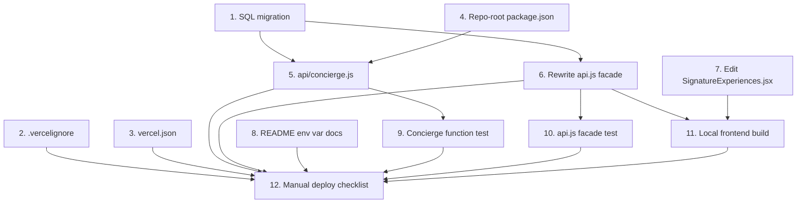

# Implementation Plan

## Overview

This plan migrates Pride Vacations from React + FastAPI + MongoDB to React + Supabase + a single Vercel Node serverless function for the AI Concierge. Tasks are ordered by dependency: the SQL migration and Vercel config land first, then the serverless function and the rewritten `api.js` facade, then verification.

**Hard constraints applied to every task** (from Requirements §6, §8):

- No edits under `frontend/src/components/`, `frontend/src/pages/`, `frontend/src/App.js`, `frontend/src/index.js`, `frontend/src/index.css`, `frontend/tailwind.config.js`, `frontend/postcss.config.js`, or `frontend/public/` — with the single exception of removing the `/api/setup/seed` reference in `SignatureExperiences.jsx` (Task 7).
- No Python in the deploy bundle. `backend/` stays in git history but is excluded from the Vercel build.
- `OPENAI_API_KEY` and `SUPABASE_SERVICE_ROLE_KEY` never appear in the client bundle, response bodies, or logs.

## Tasks

- [x] 1. Author the idempotent SQL migration
  - Create `supabase/migrations/0001_vercel_migration.sql`.
  - Include `create extension if not exists "pgcrypto";` and `create table if not exists` for `experiences`, `travel_stories`, `leads_inquiries`, `admin_users` matching `SUPABASE_SCHEMA.sql`.
  - Add `create table if not exists public.conversations (id uuid primary key default gen_random_uuid(), conversation_id text not null unique, messages jsonb not null default '[]'::jsonb, created_at timestamptz not null default now(), updated_at timestamptz not null default now());`.
  - `alter table` to enable RLS on all five tables.
  - `drop policy if exists` then `create policy` for: `public_read_experiences` (select on experiences, anon+authenticated, using true), `public_read_stories` (select on travel_stories, anon+authenticated, using true), `public_insert_leads` (insert on leads_inquiries, anon+authenticated, with check true), `admin_select_leads` (select on leads_inquiries, authenticated, using `exists (select 1 from public.admin_users a where a.user_id = auth.uid())`), `admin_update_leads` (update on leads_inquiries, authenticated, same `using` clause), `admin_read_admins` (select on admin_users, authenticated, using `user_id = auth.uid()`).
  - Do NOT create any policy on `conversations` (RLS enabled + no policy = anon and authenticated denied; service role bypasses RLS).
  - Seed `experiences` and `travel_stories` rows from `backend/server.py` payloads `_seed_experiences_payload`, `_full_catalog_payload`, `_seed_stories_payload`, `_extra_stories_payload`. Use `insert ... on conflict (slug) do update set <all non-key columns>` for idempotency.
  - Verify by running the file twice in a scratch Supabase project: row counts must be identical after both runs.
  - _Requirements: 1.5, 5.6, 5.7, 7.1, 7.2, 7.3, 7.4, 7.5, 10.1_

- [x] 2. Add `.vercelignore` to exclude non-deployable assets
  - Create `.vercelignore` at repo root listing: `backend/`, `test_reports/`, `memory/`, `.emergent/`, `**/__pycache__/`, `*.pyc`, `.env*`, `frontend/node_modules/`, `frontend/build/`.
  - Confirm the deployed bundle contains zero Python files via the Vercel build log on first deploy.
  - _Requirements: 1.5_

- [x] 3. Add the repo-root `vercel.json`
  - Create `vercel.json` at repo root with:
    - `buildCommand`: `cd frontend && npm install && npm run build`
    - `outputDirectory`: `frontend/build`
    - `rewrites`: `[{ "source": "/((?!api/).*)", "destination": "/index.html" }]`
  - Do not declare a `functions` block — Vercel auto-discovers `api/*.js`. Do not set a `framework` override; the build command is explicit.
  - _Requirements: 1.1, 1.2, 1.3, 1.4_

- [x] 4. Add a repo-root `package.json` for the serverless function bundle
  - Create `package.json` at repo root containing only the dependencies needed by `api/concierge.js`: `@supabase/supabase-js` (match the version used in `frontend/package.json`, currently `^2.45.4`) and `openai` (use `^4.x` — the latest v4 line — since this is the modern Node SDK).
  - Set `"private": true`, `"name": "pride-vacations-functions"`, no scripts beyond `test`, no `type: module` (use CommonJS to keep the function maximally compatible with Vercel's default Node runtime).
  - Do NOT add `react`, `react-scripts`, or any frontend deps here — those stay in `frontend/package.json`.
  - _Requirements: 1.6, 5.1_

- [x] 5. Implement `api/concierge.js` (Vercel Node serverless function)
  - Create `api/concierge.js` exporting a default async handler `(req, res) => Promise<void>`.
  - At module top, lazily construct the Supabase service-role client and the OpenAI client from `process.env.SUPABASE_URL`, `process.env.SUPABASE_SERVICE_ROLE_KEY`, `process.env.OPENAI_API_KEY`. Never log or echo these values.
  - Reject non-POST methods with HTTP 405.
  - Validate body: parse JSON, require `message` to be a non-empty string. On failure return HTTP 400 `{ error: "message is required" }` and do NOT call OpenAI.
  - Return HTTP 500 `{ error: "Server misconfigured" }` (generic message, no variable names) if any of the three env vars is undefined at request time.
  - Generate a UUID for `conversation_id` if the request omits one or sends `null`.
  - When `conversation_id` is provided, `select messages from public.conversations where conversation_id = $1` to load prior turns.
  - Compose OpenAI messages: `[{role:'system', content: SYSTEM_PROMPT}, ...prior_messages_mapped_to_{role,content}, {role:'user', content: message}]`. Use the exact `SYSTEM_PROMPT` text from `backend/server.py` (the multi-line concierge system prompt).
  - Call `openai.chat.completions.create({ model: 'gpt-4o-mini', temperature: 0.8, max_tokens: 400, messages })`. Wrap in try/catch. On failure return HTTP 502 `{ error: "Concierge unavailable" }` and do NOT persist a partial turn.
  - On success, append `{ role: 'user', content: message, ts: <ISO> }` and `{ role: 'assistant', content: reply, ts: <ISO> }` to history. `upsert` into `public.conversations` keyed by `conversation_id` setting `messages` and `updated_at`; on insert set `created_at` to now.
  - Respond 200 with `{ conversation_id, reply, messages: history.map(m => ({role:m.role, content:m.content})) }`.
  - _Requirements: 5.1, 5.2, 5.3, 5.4, 5.5, 5.8, 5.9, 5.10, 9.3, 9.5_

- [x] 6. Rewrite `frontend/src/lib/api.js` as a Supabase-backed facade
  - Keep the public surface: `export const api` with methods `get(path)`, `post(path, body)`, `patch(path, body)`. Keep `export const API` (still derived from `REACT_APP_BACKEND_URL` for backward compatibility, but unused for non-concierge calls).
  - Implement a router that pattern-matches paths against this dispatch table:
    - `GET /experiences` → `supabase.from('experiences').select('*').order('sort_order', { ascending: true })`
    - `GET /experiences/:slug` → `supabase.from('experiences').select('*').eq('slug', slug).maybeSingle()` — when `data === null` throw an error with `response = { status: 404, data: { detail: 'Experience not found' } }`
    - `GET /stories` → `supabase.from('travel_stories').select('*').order('created_at', { ascending: false })`
    - `GET /stories/:slug` → `supabase.from('travel_stories').select('*').eq('slug', slug).maybeSingle()` — same 404 mapping when `null`
    - `POST /leads` → coerce empty-string fields to `null` (mirrors legacy `empty_to_none` validator), then `supabase.from('leads_inquiries').insert(payload).select().single()`
    - `GET /admin/leads` → `supabase.from('leads_inquiries').select('*').order('created_at', { ascending: false })`
    - `PATCH /admin/leads/:id` → strip undefined, `supabase.from('leads_inquiries').update(body).eq('id', id).select().single()`
    - `GET /admin/experiences` → `supabase.from('experiences').select('*').order('sort_order', { ascending: true })`
    - `POST /concierge` → `fetch('/api/concierge', { method: 'POST', headers: { 'Content-Type': 'application/json' }, body: JSON.stringify(body) })` — when `REACT_APP_BACKEND_URL` is empty/unset, the relative `/api/concierge` resolves on the same Vercel origin as the SPA.
  - Wrap every call to return an axios-shaped envelope: `{ data, status }`. On success use `status: 200` (or `201` for `POST /leads` to match legacy semantics). On failure throw an `Error` whose `response` field carries `{ status, data }` so existing `e.response?.status === 404` checks in `ExperiencePage.jsx` and `StoryPage.jsx` keep working.
  - Map Supabase error codes: `PGRST116` (no rows from `single()`) → 404; permission/RLS errors (`42501`, message contains "permission denied") → 403; other Supabase errors → 500. For `/api/concierge` HTTP non-2xx, propagate `response.status` from the fetch result; network failure → 502.
  - Do NOT use axios for Supabase calls (Supabase JS client handles auth headers itself via the persisted session). Keep `axios` imported only for backward compatibility — or remove the dependency entirely if no other module uses it (verify with a repo-wide search before removing).
  - _Requirements: 2.1, 2.2, 2.3, 2.4, 2.5, 2.6, 3.1, 3.5, 4.4, 4.5, 4.6, 4.7, 4.8, 6.1, 6.2, 6.3, 6.4, 6.5, 9.2_

- [x] 7. Remove the legacy `/api/setup/seed` reference in `SignatureExperiences.jsx`
  - Read `frontend/src/components/SignatureExperiences.jsx` and locate the empty-state copy block (around lines 100–110) that mentions `{process.env.REACT_APP_BACKEND_URL}/api/setup/seed`.
  - Remove the `<code>` element and the surrounding sentence ("Then visit … (POST) to seed sample experiences and your admin account.") OR rewrite the empty-state copy to refer to running the SQL migration in the Supabase SQL Editor — whichever yields the smallest visual diff. Prefer the rewrite if the empty-state branch is reachable in normal operation; prefer deletion if it is dev-only scaffolding.
  - This is the ONLY permitted edit under `frontend/src/components/` per Requirement 6.6.
  - Verify with a repo-wide search — zero matches for `setup/seed` under `frontend/src/` after the edit.
  - _Requirements: 6.6, 7.6, 8.2_

- [x] 8. Document the Vercel environment variable contract
  - Create or update a top-level `README.md` (or `DEPLOY.md`) section titled "Vercel deployment" listing exactly these env vars: `REACT_APP_SUPABASE_URL`, `REACT_APP_SUPABASE_ANON_KEY` (build-time, frontend), `OPENAI_API_KEY`, `SUPABASE_URL`, `SUPABASE_SERVICE_ROLE_KEY` (server-side, function only).
  - Note that `REACT_APP_BACKEND_URL` is now optional and ignored for everything except as a no-op compatibility shim.
  - Include the three-step operator runbook: (1) run `supabase/migrations/0001_vercel_migration.sql` in Supabase SQL Editor, (2) create the admin user via Supabase Auth → Users → Add user, then insert a row into `admin_users` linking that auth user, (3) set the five env vars in Vercel project settings and deploy.
  - _Requirements: 9.1, 9.3, 9.4_

- [x] 9. Add a smoke test for `api/concierge.js`
  - Create `api/__tests__/concierge.test.js` (or similar) using a minimal Node test runner — `node --test` is sufficient and requires zero new deps.
  - Test cases: (a) POST with empty `message` returns 400 with no OpenAI call; (b) GET returns 405; (c) missing env var returns 500 with no leak of variable names; (d) successful path persists a turn and returns the expected response shape (mock OpenAI and Supabase clients).
  - Add an `npm test` script to the repo-root `package.json` that runs `node --test api/__tests__/`.
  - _Requirements: 5.5, 5.8, 5.9, 9.5_

- [x] 10. Add a unit test for the rewritten `api.js` facade
  - Create `frontend/src/lib/__tests__/api.test.js`. Use the existing CRA + Jest setup (already wired by react-scripts).
  - Mock `./supabase` and `global.fetch`. Assert: `api.get('/experiences')` returns `{ data: [...], status: 200 }`; `api.get('/experiences/:slug')` with no row throws an error whose `response.status === 404`; `api.post('/leads', { phone: '' })` insert payload has `phone: null` (empty-string coercion); `api.patch('/admin/leads/x', {status:'won'})` returns the updated row; `api.post('/concierge', body)` POSTs to `/api/concierge` (relative URL) and returns the parsed JSON envelope; HTTP 502 from `/api/concierge` throws with `response.status === 502`.
  - _Requirements: 2.3, 2.6, 3.5, 4.5, 5.5, 6.4, 6.5_

- [x] 11. Local build verification
  - Run `cd frontend && npm install && npm run build`.
  - Confirm the build succeeds with no errors and no new warnings beyond the pre-migration baseline.
  - Confirm `frontend/build/index.html` exists.
  - _Requirements: 1.2, 8.2_

- [x] 12. Manual deploy verification checklist
  - Deploy to a Vercel preview environment with the five env vars from Task 8 set.
  - Walk through this checklist; each line below maps to one or more requirements:
    - `GET /` returns 200 with the homepage rendered. _(Req 1.4)_
    - Hard-refresh on `/experiences/wake-above-the-clouds` returns 200 (no 404). _(Req 1.3)_
    - `/experiences` and `/stories` index pages render the same cards as the pre-migration build. _(Req 2.1, 2.4, 8.1)_
    - Submitting `InquiryForm` succeeds and shows the same success state. _(Req 3.1, 8.3)_
    - Browsing as anon, calling `select()` on `leads_inquiries` from the browser console returns zero rows or a permission error. _(Req 3.3)_
    - Admin login works via Supabase Auth; `/admin` lists leads and experiences. _(Req 4.4, 4.6, 8.5)_
    - Updating a lead status from `/admin` replaces the row in-place without a page reload. _(Req 4.5, 8.6)_
    - Two messages to the AI concierge in the same session: the second OpenAI call (verified by inspecting the `conversations` row in Supabase) contains the first user+assistant pair as prior turns. _(Req 5.4, 8.4)_
    - Hitting `/api/concierge` with empty `message` returns 400. _(Req 5.9)_
    - Vercel deploy log shows no Python files in the function bundle. _(Req 1.5)_
    - Browser DevTools → Sources contains no `OPENAI_API_KEY` or `SUPABASE_SERVICE_ROLE_KEY` in the bundle. _(Req 9.3)_
    - Re-running the SQL migration in Supabase SQL Editor produces zero new rows in `experiences` and `travel_stories`. _(Req 7.5)_
    - Reverting the Vercel deployment to a pre-migration commit leaves the `conversations` table rows intact. _(Req 10.2)_
  - _Requirements: 8.1, 8.3, 8.4, 8.5, 8.6, 10.2_

## Notes

- Tasks 1, 2, 3, 4, 7, and 8 have no upstream dependencies and can run concurrently in Wave 1.
- Tasks 5 and 6 require the migration (its target table must exist) and Task 5 also needs the function `package.json`.
- Tasks 9, 10, 11 are verification steps for 5, 6, and the combined frontend respectively.
- Task 12 is the final deploy gate — it cannot run until every other task is complete and a Vercel preview URL exists.
- The legacy FastAPI backend in `backend/` stays in version control history (excluded from the Vercel bundle via `.vercelignore`) so a roll-forward to the prior deploy from an earlier commit remains possible per Requirement 10.3.

## Task Dependency Graph



```json
{
  "waves": [
    {
      "wave": 1,
      "tasks": ["1", "2", "3", "4", "7", "8"]
    },
    {
      "wave": 2,
      "tasks": ["5", "6"]
    },
    {
      "wave": 3,
      "tasks": ["9", "10", "11"]
    },
    {
      "wave": 4,
      "tasks": ["12"]
    }
  ]
}
```
